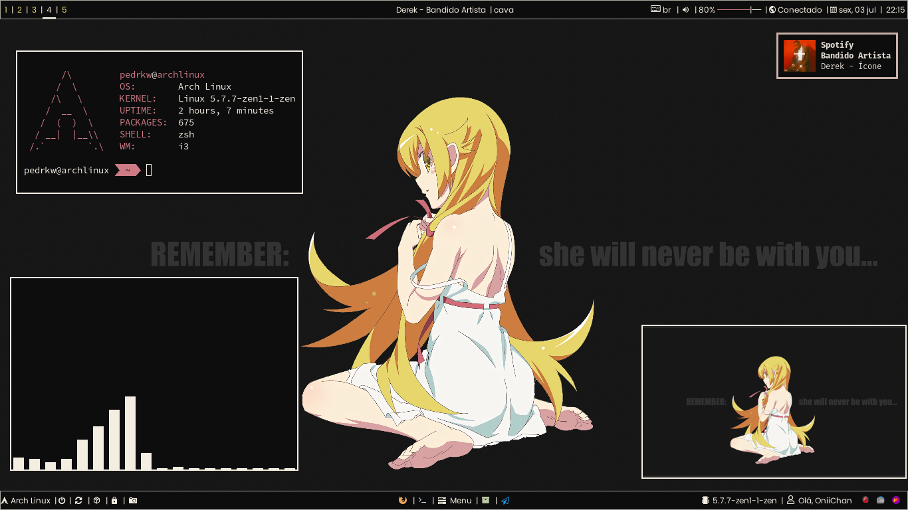
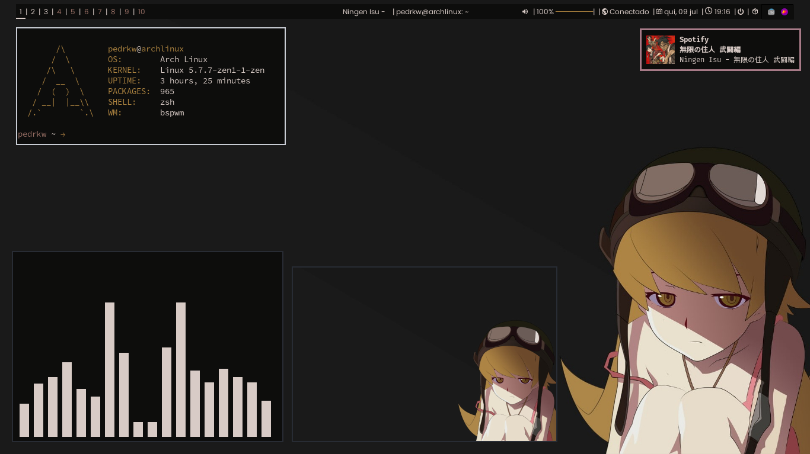

# dotfiles
## personal dotfiles by pedrkw

|   Programs I use       |   Description                                               |
| :---                   |     :---:                                                   |
| `i3-gaps`              | Window manager                                              |
| `polybar`              | Status bar                                                  |
| `rofi`                 | Application launcher                                        |
| `pywal`                | Generate and change color-schemes on the fly                |
| `rxvt-unicode / kitty` | Terminal                                                    |
| `mpv`                  | Multimidia player                                           |
| `dunst`                | Notification-daemons                                        |
| `pcmanfm`              | File manager                                                |
| `viewnior`             | Image view                                                  |
| `firefox`              | Browser                                                     |
| `vscode` / `vim`       | Text editor                                                 |
| `transmission`         | BitTorrent client                                           |
| `flameshot` / `scrot`  | Screenshot progam                                           |
| `feh`                  | Image view and set wallpaper                                |

## Arch
`I use Arch Linux`

`Note:` 
Some scripts used in polybar depend on extra packages.
I use arch linux, so some settings on the polybar were made exclusively for this use.

## My i3-gaps personalization

## My bspwm personalization

